# 📰 Telegram News Digest Bot (n8n Workflow)

A fully automated, state-of-the-art n8n workflow that fetches news from multiple RSS feeds, filters duplicates/spam, uses AI (LLAMA 3.3 via Groq) to generate concise summaries, scrapes Open Graph (OG) header images directly from target sites, and delivers a polished digest to users in Telegram.

---

## 🚀 How the Bot Works

When a user interacts with the bot on Telegram, the workflow executes the following lifecycle:

1. **Trigger & Routing:** The bot accepts user commands (`/start` or `/news`) or button callback clicks, routing the execution flow accordingly.
2. **Interactive Menu:** It serves an inline keyboard menu allowing the user to select their desired news category: **Tech**, **World**, or **National**.
3. **Multi-Source RSS Aggregation:** Once selected, the bot queries multiple top-tier RSS feeds in parallel (e.g., TechCrunch, BBC, NDTV) and merges them.
4. **Deduplication & Spam Filtering:** Custom JavaScript logic filters out duplicate URLs and filters out promotional posts using a keyword blocklist.
5. **AI Summarization:** The top news articles are summarized into 3-4 clean sentences using the **Llama 3.3-70B model** via **Groq**.
6. **Smart Image Scraping (OG Scraper):** If the RSS feed lacks an image, the workflow fetches the article's webpage in the background to scrape the Open Graph metadata (`og:image`) for a rich preview.
7. **Rate-Limit-Safe Delivery:** Articles are sent to the user one-by-one with a brief delay between messages to prevent triggering Telegram's rate limits, displaying beautiful media cards (or text cards if no image is available).
8. **Completion Sign:** Once all articles are dispatched, the bot edits the temporary loading message to confirm the digest is complete.

---

## 🔍 Detailed Node Explanations

Here is a breakdown of every node in the workflow, organized by function:

### 1. Entry & Event Handling
*  **Telegram Trigger:** Listens to incoming events from Telegram (commands and keyboard button clicks).
* 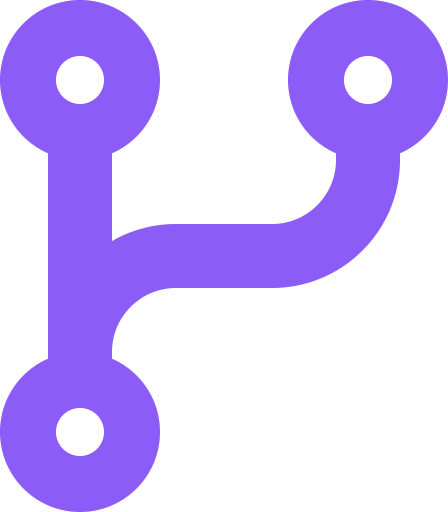 **Detect Event Type (Switch):** Routes logic based on what the user did:
  * Shows the category menu if they typed `/news` or `/start`.
  * Triggers the news-gathering pipeline if they clicked a category button (callback query).

### 2. Category Selection UI
*  **Send Category Keyboard (Telegram):** Sends the inline button menu (Tech, World, National).
*  **Answer Callback Query (Telegram):** Acknowledges the button click in Telegram to remove the loading spinner from the user's screen.
*  **Edit Menu Message (Telegram):** Modifies the menu keyboard message into a temporary status message (e.g., *⏳ Fetching Tech news, please wait…*) so the chat stays clean.

### 3. News Ingestion (RSS Feeds)
*  **RSS Feeds (RSS Feed Read):** Multiple parallel nodes query feed URLs:
  * **Tech:** *TechCrunch, Ars Technica, Hacker News, The Verge*.
  * **World:** *BBC News, Reuters, Al Jazeera, Deutsche Welle (DW), The Guardian*.
  * **National:** *NDTV, Times of India, The Hindu, Hindustan Times, Indian Express*.
*  **Merge, Merge1, Merge2 (Merge):** Combines the parallel streams from all RSS nodes into a single array.

### 4. Processing & AI Summarization
* 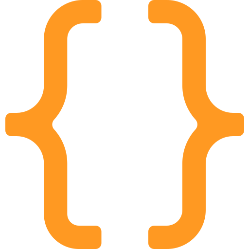 **Deduplicate Nodes (Code):** Custom JavaScript that eliminates duplicate links, applies a spam/promotional word blocklist, and limits the output to the top 10 newest articles.
*  **Basic LLM Chain Nodes (LangChain):** Combines the prompt instructions and coordinates text generation.
*  **Groq Chat Model Nodes (LangChain):** Connects to **Groq** using the `llama-3.3-70b-versatile` model to write a strict, formatting-free 3-4 sentence summary of each article.
*  **Parse Groq Nodes (Code):** Extracts the text response from the LLM chain and merges it back into the article object along with any available RSS images.

### 5. Loop & Delivery
* 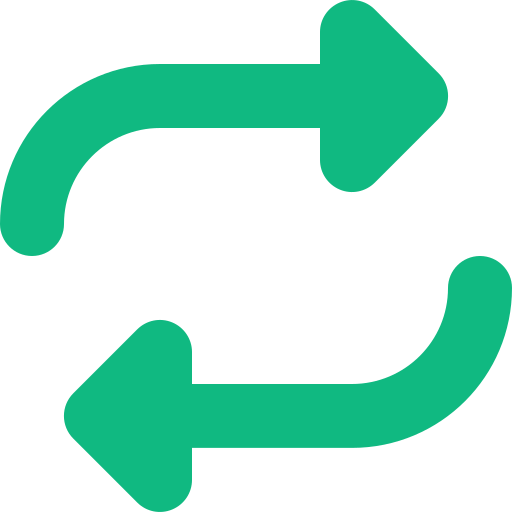 **Loop Articles (Split In Batches):** Loops through the 10 selected articles one-by-one.
*  **OG Scrape Nodes (Code):** Background HTTP scraper that fetches the article's web page and regex-extracts the metadata image tag (`og:image` or `twitter:image`) if the RSS didn't provide one.
*  **IF Has Image (IF):** Checks if a valid thumbnail image was retrieved.
*  **Send Message (Telegram):**
  * If an image exists: Sends a formatted photo card (**Send Message**) containing the image, bold title, summary, and article link.
  * If no image exists: Sends a text-only formatted card (**Send Text**).
*  **Wait Between Messages (Wait):** Pauses for 1 second between dispatches to avoid Telegram API rate limits.
*  **Limit Nodes (Limit):** Controls loop termination.
*  **Send Done (Telegram):** Replaces the temporary loading message with a digest completion indicator (e.g. *🖥️ Tech digest complete!*).

---

## 🛠️ Prerequisites & Setup

To run this workflow on your own n8n instance:

1. **Create a Telegram Bot:**
   * Message [@BotFather](https://t.me/BotFather) on Telegram and run `/newbot`.
   * Save your secret **Bot API Token**.
2. **Get a Groq API Key:**
   * Create an account at [Groq Console](https://console.groq.com/).
   * Generate an **API Key** (usage is extremely fast and cost-effective).
3. **Self-Host or Use n8n Cloud:**
   * Ensure your n8n instance has a public-facing URL (n8n requires HTTPS webhooks to receive Telegram triggers).

---

## 📥 How to Import This Workflow

1. Download the [`Telegram News Bot.json`](./Telegram%20News%20Bot.json) file from this repository.
2. Open your n8n dashboard.
3. Click on the top-right menu and choose **Import from File**.
4. Select the downloaded JSON file.
5. Setup Credentials:
   * Double-click any **Telegram** node, select your Telegram credential, and enter your **Bot API Token**.
   * Double-click the **Groq Chat Model** node, select your Groq credential, and enter your **Groq API Key**.
6. Toggle the workflow to **Active** (top right) to launch your bot!

---

## 📸 Demo & Screenshots

Here is a step-by-step walkthrough of the bot's user experience:

### 1. Main Menu Trigger
Send `/news` or `/start` to select a news category:

  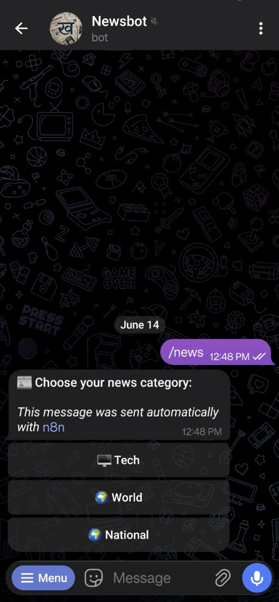

### 2. Tech News Stream
Selecting the **Tech** category triggers the aggregator:

  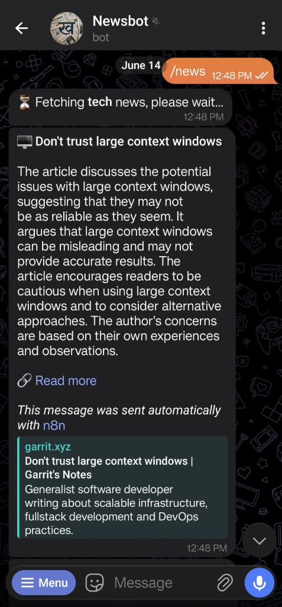
  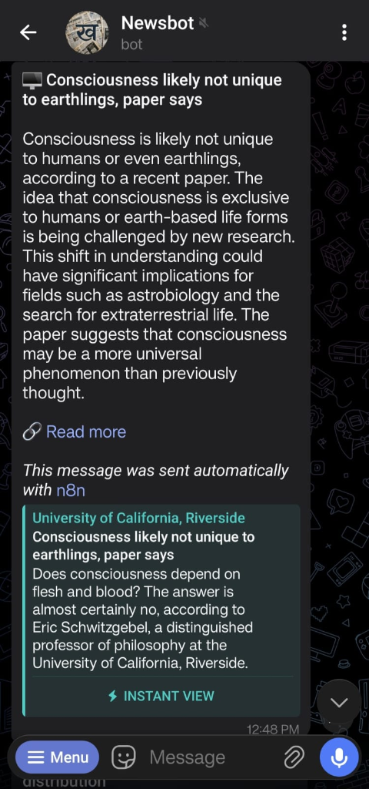
  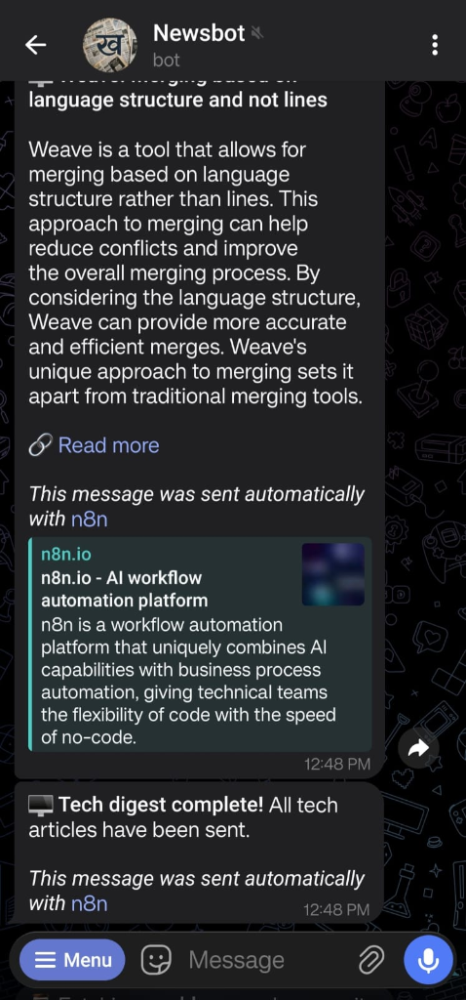

### 3. World News Stream
Selecting **World** news fetches international coverage:

  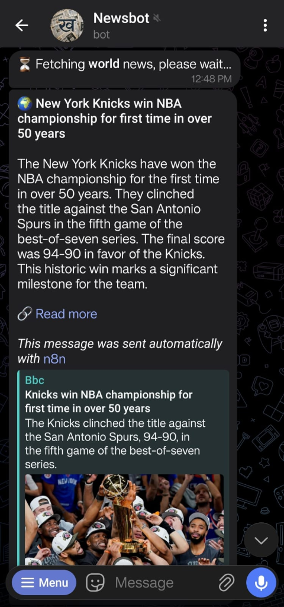
  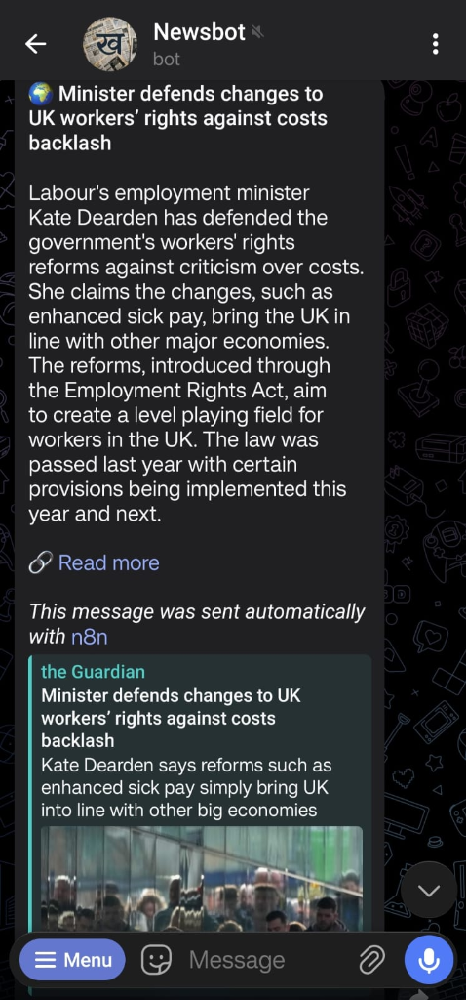

### 4. National News Stream
Selecting **National** fetches Indian news:

  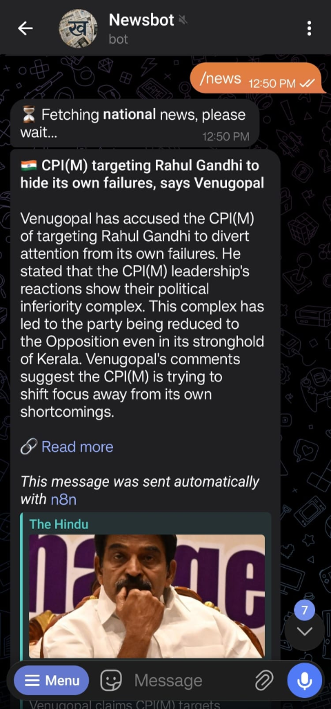
  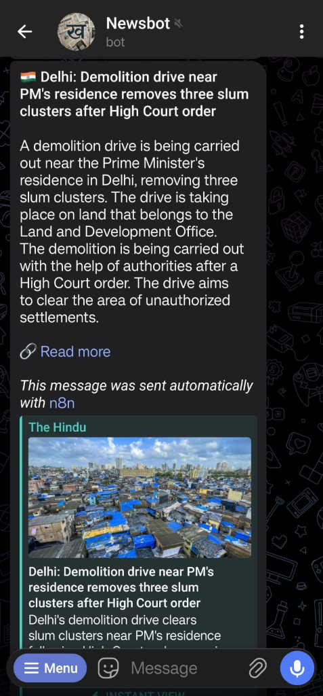
  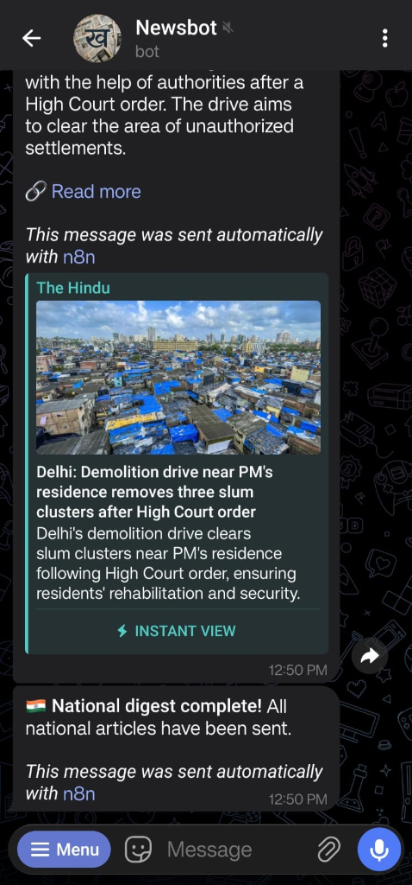

---

##TELEGRAM HAS BEEN CURRENTLY BANNED BY OUR GREAT GOV🥰
## 🤖 Try It Out!

You can test the live bot directly on Telegram:
👉 **[@Khabri01bot](https://t.me/Khabri01bot)**

*Note: Send `/news` to the bot to select a category and trigger the digest.*
